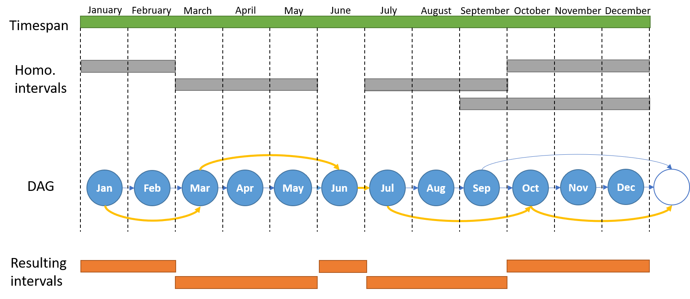

# TEDAR
TEDAR is a pharmacovigilance signal detection method  based on variable-length temporal splitting.

## Overview

The main goal is to detect, for each specific drug-adr pair, a set of intervals having different lengths that are representative of the pair under consideration.
A set of overlapping intervals are extracted for each drug-adr pair by applying a temporal data-mining approach. The notion of homogeneous interval is introduced. The covariance coefficient is engaged for detecting cutting points between the intervals in order to extract only homogeneous intervals.
Then, a graph theory-based algorithm is applied for retrieving a final set of non-overlapping intervals. Finally, TEDAR uses the PRR statistics for evaluating the significance of the retrieved intervals. 



The above image represents the generation of a DAG of intervals for extracting non-overlapping homogeneous intervals within the timespan of a specific drug-adr pair. Starting homogeneous intervals are displayed as grey rectangles. The initial structure of the DAG is the set of ordered time points (in this case months), represented as nodes (blue nodes) and linked by single edges (blue edges). Initial intervals are embedded in the DAG by adding extra edges from the starting time point to the DAG node consecutive to the one representing the end of the interval (blu edges). For this reason, an extra node is queued to the DAG (white node) in order to represent intervals in which the endpoint is the end of the timespan. Final intervals (orange rectangles) are extracted from one of the possible shortest paths (yellow path) from the start to the end of the DAG.

## Software architecture

TEDAR is released in a Docker container, that allows to isolate app from its environment, increasing replicability. All dependencies are automatically installed when the container is created (see `TEDAR/DockerContainer/TEDAR/Dockerfile`).
The TEDAR software is developed using Ruby inside Jupyter Notebook.  Reports are collected, stored and manipulated using Redis as database management system.
For the application of signal detection thresholds and the validation phase of drug-adrs detectect is used R.


### Data sources

We use as case study the surveillance database, named RNF (Rete Nazionale Farmacovigilanza), released by the Italian authority AIFA (Agenzia Italiana del Farmaco). The RNF database contains reports of ADRs issued by all the Italian regions.

ADRs are encoded according to the MedDRA (Medical Dictionary for Regulatory Activities) terminology, which consists of large set of terms structured into five hierarchical levels. System Organ Classes (SOC) are the level terminology used in this system to encode ADRs. SOC is the highest level of ADR terminology and terms here are distinguished by anatomical or physiological system, etiology or purpose.

Drug is defined as pharmaceutical product (combinations of active ingredients) according to the requirements of the ICH M5 standard adopted in RNF. We make no distinction between pharmaceutical products with the same combinations of active ingredients.

Data extraction from RNF was carried out through the Vigisegn data warehouse. Thanks to the ease of access to the registers and the ability to download the entire database, it is possible to retrieve the information necessary for the TEDAR analysis: <b> <entry date, drug,  ADR></b>.

We used the ADReCS and PROTECT datasets contained verified drug-adr relations for assessing the performances of TEDAR. The reference dataset used is obtained by merging these two datasets. Furthermore we selected only the drug-ard pairs for which a minimum number of reports equal to 5 is reported in RNF. The excluded pairs did not have enough support in the RNF dataset to be detected as signals.

Input data and reference dataset provided in this repository contain drugs encoded as: <i>drug1, drug2, ... drug3042 </i>.

Reference dataset `reference_dataset.txt` is contained in `DockerContainer/TEDAR` directory.
  

#### Input Data

The complete set of report must be provided as text file.
One report per line containing date of insertion, drug and adr separated by tabs.

A valid file is given by the following example:
```
vt	drug	soc
2017-01-02	drug169	Gastrointestinal disorders
2017-01-02	drug169	Vascular disorders
2017-01-02	drug169	Musculoskeletal and connective tissue disorders
2017-01-02	drug169	Blood and lymphatic system disorders
2017-01-11	drug170	Blood and lymphatic system disorders
2017-01-18	drug171	General disorders and administration site conditions
2017-01-20	drug172	Investigations
2017-01-20	drug172	Blood and lymphatic system disorders
2017-01-20	drug172	Hepatobiliary disorders
2017-01-23	drug32	General disorders and administration site conditions
2017-01-23	drug130	Skin and subcutaneous tissue disorders
2017-01-23	drug130	Gastrointestinal disorders
2017-01-23	drug130	Vascular disorders
2017-01-23	drug130	Gastrointestinal disorders
2017-01-23	drug130	Nervous system disorders
2017-01-23	drug158	General disorders and administration site conditions
2017-02-06	drug173	Skin and subcutaneous tissue disorders
```

Input file must be specified in `Init.ipynb` (`INPUTDATA` constant). According to the timespan to be analyzed, it is necessary to modify `START_MONTH` and `END_MONTH` in `TEDAR.ipynb` and `Compute_disprortionality.pynb` source code, i.e. timespan from 2008-1-1 to 2017-12-1 required `START_MONTH=[2008,1]` and `END_MONTH=[2017,12]` (<i>[year, month]</i>).


In the `DockerContainer/TEDAR/sciruby/` folder there are two encoded versions of our input data:

* `input_data_1y.txt`: encoded reports in collected in RNF in 2017;
* `input_data_10.rar`: encoded reports in collected in RNF in [2008,2017] (extract the .rar file);

The TEDAR version provided in this repository use `input_data_1y.txt` as default input. To use `input_data_10y.txt` see comments in `Init.ipynb` (`INPUTDATA` constant), `TEDAR.ipynb` (`START_MONTH` and `END_MONTH` constant), `Compute_disprortionality.ipynb` (`START_MONTH` and `END_MONTH` constant). 

## Usage

Docker is required.
Download and extract the repository, then go to `DockerContainer/TEDAR/` and run from terminal:
```
docker-compose up    
```

To execute the code inside the Jupyter Notebook go to http://localhost:8888/ via broswer.

  
Source code is proveded in `DockerContainer/TEDAR/sciruby/`. 
The 3 <i>ipynb</i> files can be easly run in Jupyter Notebook via graphical interface.  It is recommended to run the files in this order:

  1. `Init.ipynb`
  2. `TEDAR.ipynb`
  3. `Compute_disproportionality.ipynb`
  
  
#### Init.ipynb
  
File needed to upload input data in Redis database.
Input data must be provided as specified in [Input Data](#input-data). Set `INPUTDATA` constant to specify the path.
  
#### TEDAR.ipynb
  
Core file of TEDAR methodology. 
  
Given input data already uploaded in Redis database, homogenous intervals are obtained and writen to file `DockerContainer/TEDAR/sciruby/results/TEDAR/split/split_TEDAR.txt`.

 
`split_TEDAR.txt` is a tab separated text file that contains the homogenous intervals for each drug-adr pair in a line.
Here an example listing 3 drug-adr pairs:  
```
drug166	Product issues	0,1,13
drug429	Skin and subcutaneous tissue disorders	0,1,3,5,8,9,13
drug202	Blood and lymphatic system disorders	0,7,10,13  
```
  
Set `START_MONTH` and `END_MONTH` to specify the timespan to be analyzed,  i.e. timespan from 2008-1-1 to 2017-12-1 required `START_MONTH=[2008,1]` and `END_MONTH=[2017,12]` (<i>[year, month]</i>).

 
#### Compute_disproportionality.ipynb
  
Compute  PRR and metrics applied in thresholds (Confidence Interval and Chi-squared statistics).

Set `START_MONTH` and `END_MONTH` to specify the timespan to be analyzed,  i.e. timespan from 2008-1-1 to 2017-12-1 required `START_MONTH=[2008,1]` and `END_MONTH=[2017,12]` (<i>[year, month]</i>).
  
The computation of the 4 methodologies tested in this project is allowed: <i>TEDAR</i> (variable length intervals), <i>PRR monthly</i> (1 month length intervals), <i>PRR quarterly</i> (3 months length intervals), <i>PRR yearly</i> (annual length intervals). 
  
TEDAR analysis requires the generation of `split_TEDAR.txt` as described in [TEDAR.ipynb](#tedaripynb).
  
For each methodologies a files in `results` directory reports the metrics obtained (`DockerContainer/TEDAR/sciruby/results/TEDAR/result_TEDAR.txt`, `DockerContainer/TEDAR/sciruby/results/TEDAR/result_prr_monthly.txt`, `DockerContainer/TEDAR/sciruby/results/TEDAR/result_prr_quarterly.txt`, `DockerContainer/TEDAR/sciruby/results/TEDAR/result_prr_yearly.txt`).  
 
Output file is a tab separated text file containing a line for each intervals of the analysed drg-adr pairs:
```
Drug Adr Start_month End_month Prr LowerBoundConfidenceInterval UpperBoundConfidenceInterval Chi-squared NumberOfReportInIntervals
```
  
An example of output file is showed in the following lines listing results for pairs <i>"drug166-Product issues"</i> and <i>"drug289-Gastrointestinal disorders"</i> using TEDAR (variable lenght intervals) in timespan <i>[2017-1-1,2017-12-31]</i>:
```
drug166	Product issues	[2017, 1]	[2017, 3]	13.567421790722761	5.702329665607122	32.28065454679049	51.50491267314168	5
drug166	Product issues	[2017, 4]	[2017, 6]	0.0	0.0	NaN	0.19328512034182097	0
drug166	Product issues	[2017, 7]	[2017, 9]	0.0	0.0	NaN	0.09696418479286524	0
drug166	Product issues	[2017, 10]	[2017, 12]	0.0	0.0	NaN	0.4265674326620676	0
drug289	Gastrointestinal disorders	[2017, 1]	[2017, 3]	0.13697869244542418	0.01964111254018487	0.9553003754583395	5.470147794547452	1
drug289	Gastrointestinal disorders	[2017, 4]	[2017, 6]	0.8410845847520452	0.33146707846440043	2.1342188249428142	0.30023831513894006	4
drug289	Gastrointestinal disorders	[2017, 7]	[2017, 9]	1.2641056422569028	0.6881028636443149	2.322273542537871	0.033651415267548335	9
drug289	Gastrointestinal disorders	[2017, 10]	[2017, 12]	0.5401822700911351	0.20967439923221448	1.3916667270268261	1.8536783809609447	4  
```
  
  
  
  

## Citation

Submitted.
  
## License
[MIT](https://choosealicense.com/licenses/mit/)
